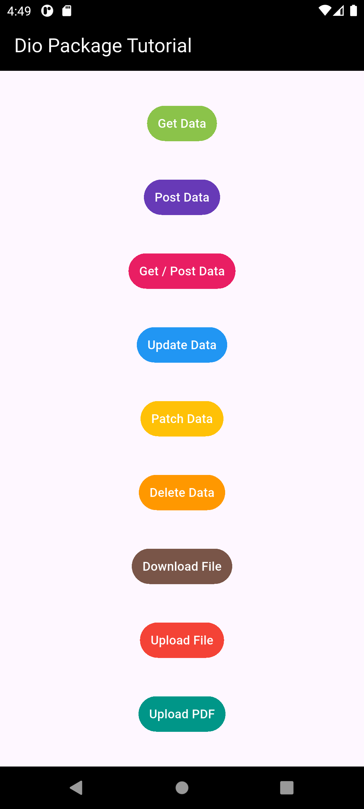

# **Dio Package Tutorial**

## **📘 Overview**

A **Flutter-based CRUD and File Handling App** using the **Dio package**. It demonstrates how to perform various HTTP operations like **GET, POST, PUT, PATCH, DELETE**, and how to **download/upload files** including **images and PDFs** using Dio 📡.

---

## **📱 Features**

- **Get Data**: Fetches data from the internet.
- **Post Data**: Sends data to a server.
- **Get & Post Together**: Uses `Future.wait` for combined requests.
- **Update Data (PUT)**: Replaces data at a given endpoint.
- **Patch Data**: Partially updates data.
- **Delete Data**: Deletes data from the server.
- **Download File**: Downloads and saves files locally.
- **Upload File**: Uploads images to **ImgBB**.
- **Upload PDF**: Uploads PDFs to **PDF.co**.

---

## **🖼️ Screenshots**



## **🚀 Getting Started**

1. **Clone the Repository**:
   ```bash
   git clone https://github.com/WaleedTaj/dio_package_tutorial.git
   ```
2. **Install Dependencies**:
   ```bash
   flutter pub get
   ```
3. **Run the App**:
   ```bash
   flutter run
   ```

## **🧰 Packages Used**

- **dio**: For all networking tasks
- **file_picker**: Picking images/files from the system
- **path_provider**: To get directory paths
- **flutter/material.dart**: UI development

## **🛠️ Built With**

- **Flutter** - Framework for cross-platform development.
- **Dart** - Programming language for Flutter apps.
- **Dio** - Advanced HTTP client for networking.